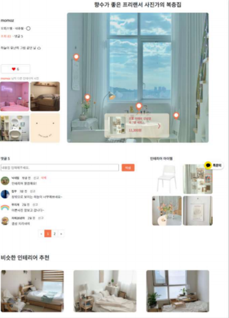
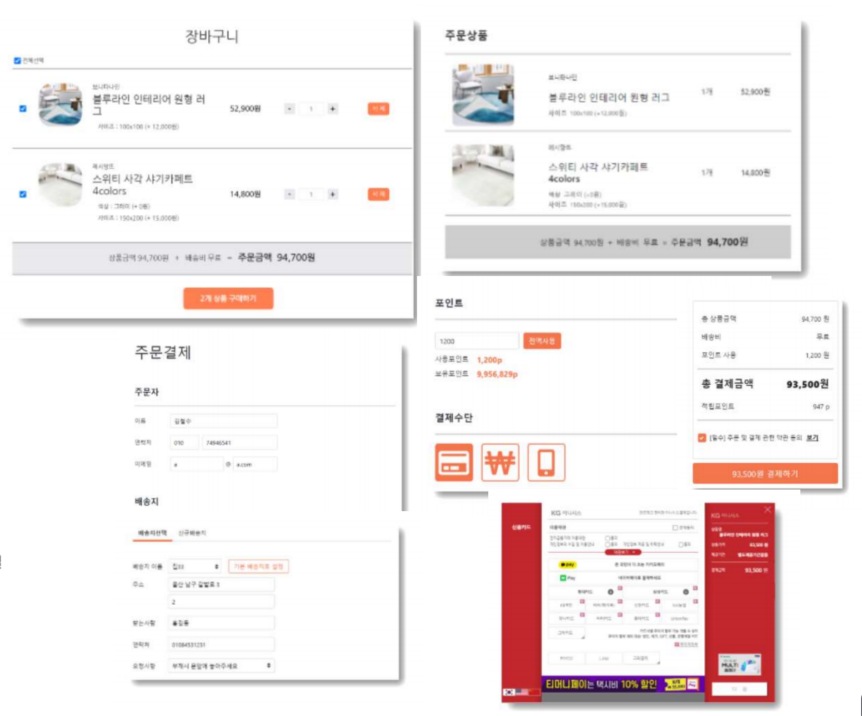

# wanza

   
  
   

 

## 프로젝트 소개

▶ 팀 이름 : Wanza Interior 
▶ 프로젝트명 : 완벽한 자취생활, 완자 
▶ 참여인원 : 4명 
▶ 개발기간 : 2021.04 ~ 2021.06 
▶ 내 용 : 1인 가구를 위한 소셜 커머스 
▶ 프로젝트 발표 영상 : https://youtu.be/iAMmGLqxAhQ 

 

## 기술 스택
</a>&nbsp;
</a>&nbsp;
</a>&nbsp;
 
</a>&nbsp;
</a>&nbsp;
</a>&nbsp;
 
</a>&nbsp;
</a>&nbsp;
  

 

## 내가 담당한 기능 List

 

### - Home

---
### 1. 전체적인 화면 Layout 구축

  
   

   

---
### 2. 커뮤니티(스토리) 게시판 구현

   
  
   
   
  
**- 스토리 게시판 List**
  
1. 썸네일, 제목, 닉네임, 좋아요 count, 조회수 count 표기
  
  
   

   
  
   
  
**- 스토리 게시판 상세페이지**

  1. 메인 사진 마커 Hover 시 판매 링크 팝업 생성
  2. 좋아요 버튼 구현 (계정당 1번. 2번 클릭 시 취소)
  3. 해당 계정의 다른 글 이미지 표현.
  4. 댓글 기능 구현 (최신순, 페이징, 신고, 수정, 삭제)
  5. 메인 사진의 인테리어 아이템 이미지 표현 (클릭 시 판매 페이지 이동)
  6. 비슷한 카테고리의 인테리어글 추천

  

---
### 3. 스토어(상품판매) 게시판 구현

   
  
   
   
  
**- 스토어 게시판 List**
  
1. 썸네일, 제목, 가격, 할인율, 별점, 리뷰 count 표기
  
  
   

   
  
   
  
**- 스토어 게시판 상세페이지**

  1. 메인 이미지, 제목, 가격, 옵션 선택에 따른 가격 표시
  2. 후기 등록 및 후기 평점 표기
  3. 상품 문의 등록 (답변상태, 시간 표기)

  

---
### 4. 장바구니, 결제 구현

   
  
   
   
  
**- 장바구니, 결제 시스템**
  
  1. 장바구니 페이지 - 장바구니 옵션, 개수에 따른 가격 표기
  2. 주문결제 페이지 - 주문자, 배송지 표기. 포인트 사용 기능. 결제수단 선택 기능.
  3. 결제 - 아임포트 API 연동
  
  
   

  

### - Admin

---
### 1. 상품 등록 구현

   
  
   
   
  
**- 상품 등록 페이지 (admin)**
  
  1. 상품 제목, 이미지, 가격, 할인가격, 분류, 해시태그, 상품 옵션(가격), 내용 등록
  
  
   

  

---
### 2. 스토리 상품 태그 등록 구현

   
  
   
   
  
**- 상품 태그 등록 페이지 (admin)**
  
  1. 유저의 스토리글에 판매중인 아이템 태그 등록 구현
  2. 이미지 클릭 시 좌표 생성
  3. 등록할 상품 선택 (검색)
  4. 좌표 Hover시 삭제 버튼 팝업 생성
  

   

  

---
### 3. 상품 답변 등록 구현

   
  
   
   
  
**- 상품 답변 등록 페이지 (admin)**
  
  1. 등록된 모든 답변 리스트 구현 (조건,상세 검색)
  2. 답변 작성 가능
  3. 답변 완료 시 작성상태 변경 및 홈페이지 반영
  

   

  

---
## 프로젝트를 통해 느낀 점
  

### - 프로젝트의 정확한 목표와 설계
 
  이번 프로젝트의 목표는 커뮤니티 & 상품 판매 사이트 구현이었다. 평소에 인테리어에 관심이 많은 터라 팀원들과 회의 끝에
  1인 가구를 위한 인테리어 사이트를 구현하기로 정하고, 기존 유명한 인테리어 사이트를 레퍼런스로 삼아 카카오 오븐을 통해 프로토타입을 만들었다.
  확실한 것은 프로토타입을 만들고 웹 UI 구현을 진행하니, 중간중간 '더 괜찮을 것 같은 디자인인데?' 하는 유혹을 뿌리치고, 중구난방 갈 수 있었던 디자인을 통일감있게 정리할 수 있었다.
  

### - 내가 구현해보고 싶은 것
 
레퍼런스 사이트를 참고하다보니 구현해보고 싶은 기능들이 있었다.
예를 들어, 유저가 올린 이미지에 관리자가 판매중인 상품을 마커로 추가하는 기능이라던지, 작성일을 년월일, 시분초가 아닌 x분 전, x시간 전, x일 전 등으로 표기를 하는 것들이
인터랙티브하면서도 세련 되어보였다. 이런 부분들도 놓치지 않고 개발을 함께 진행했었다.
  

### - 프로젝트 개발에 어려웠던 부분
 
시간이 제법 소요됐던 곳은 장바구니, 결제 시스템이었다.
관리자가 상품을 등록할 때 상품 옵션마다 추가 금액을 지정할 수 있도록 구현했고, 유저가 상품을 구매 할때는 옵션 추가 유무, 개수에 따라 가격이 변동하고,
바로 구매 시에는 장바구니에 담기지 않으며 결제창으로 바로 가야하고, 장바구니에 담았을 때는 장바구니에서 체크된 상품만 결제가 되야 하며, 
결제 완료 시에는 장바구니에는 결제하지 않았던(체크되지 않았던) 상품들은 남아있어야 한다.
말로 설명하기도 복잡하지만, UI와 쿼리를 지속적으로 테스트하며 개선해 나갔다. (잘못된 테이블 설계에 테이블 수정도 빈번했다..)
  

### - 프로젝트를 마치고 아쉬운 점
 
RestAPI를 구현하는데 결제 시스템에서 중요한 트랜잭션 처리를 생각해보지 못했던게 제일 아쉬웠다.
각종 에러를 발생시키고, 그 에러 처리과정에 대해서 생각해보고 구현해보는 것이 필요해보였다. 오로지 기능이 성공적으로 작동했을 경우만 판단하는게 아쉬웠고, 다음 프로젝트에서는 이런 부분을
좀 더 고려해 볼 필요가 있어보인다.

  

